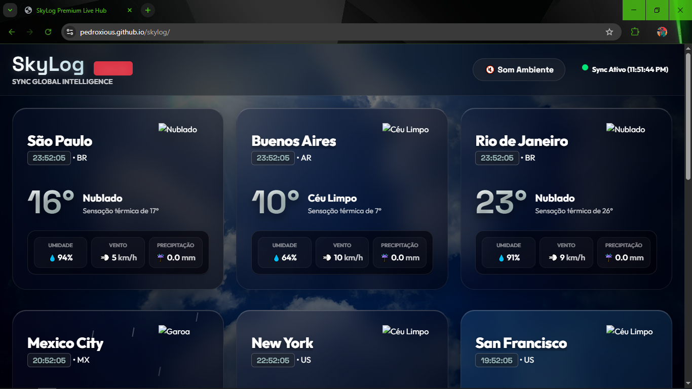

# 🌍 SkyLog — Global Weather Dashboard

### Monitoramento climático em tempo real de 12 cidades ao redor do mundo

---

### Sync Ativo • Última atualização: 00:31 (BRT)
*Projeto em expansão, operando com automações no GitHub Actions para manter métricas globais atualizadas em tempo real. Consulte a aba superior para a versão Web.*

 

## 🏙️ São Paulo, Brasil

<table>
  <tr>
    <td align="center" width="50%">
      
    </td>
    <td align="center" width="50%">
      
    </td>
  </tr>
</table>

| Parâmetro | Medição em Tempo Real |
|:---:|:---:|
| **Temperatura** | 13.6°C (Sensação: 12.7°C) |
| **Variação (Mín/Máx)** | 13.3°C — 15.4°C |
| **Umidade** | 91% |
| **Vento** | 10.5 km/h |
| **Condição Atual** | Nublado |
| **Horário Local** | 00:30 |

 
 

## 🏙️ Rio de Janeiro, Brasil

<table>
  <tr>
    <td align="center" width="50%">
      
    </td>
    <td align="center" width="50%">
      
    </td>
  </tr>
</table>

| Parâmetro | Medição em Tempo Real |
|:---:|:---:|
| **Temperatura** | 19.5°C (Sensação: 22.2°C) |
| **Variação (Mín/Máx)** | 19.3°C — 21.7°C |
| **Umidade** | 94% |
| **Vento** | 2.7 km/h |
| **Condição Atual** | Nublado |
| **Horário Local** | 00:30 |

 
 

## 🏙️ Buenos Aires, Argentina

<table>
  <tr>
    <td align="center" width="50%">
      
    </td>
    <td align="center" width="50%">
      
    </td>
  </tr>
</table>

| Parâmetro | Medição em Tempo Real |
|:---:|:---:|
| **Temperatura** | 8.1°C (Sensação: 5.3°C) |
| **Variação (Mín/Máx)** | 6.1°C — 11.6°C |
| **Umidade** | 66% |
| **Vento** | 7.5 km/h |
| **Condição Atual** | Céu limpo |
| **Horário Local** | 00:30 |

 
 

## 🏙️ Mexico City, México

<table>
  <tr>
    <td align="center" width="50%">
      
    </td>
    <td align="center" width="50%">
      
    </td>
  </tr>
</table>

| Parâmetro | Medição em Tempo Real |
|:---:|:---:|
| **Temperatura** | 16.2°C (Sensação: 16.7°C) |
| **Variação (Mín/Máx)** | 13.7°C — 25.7°C |
| **Umidade** | 78% |
| **Vento** | 1.9 km/h |
| **Condição Atual** | Parcialmente nublado |
| **Horário Local** | 21:30 |

 
 

## 🏙️ Tokyo, Japão

<table>
  <tr>
    <td align="center" width="50%">
      
    </td>
    <td align="center" width="50%">
      
    </td>
  </tr>
</table>

| Parâmetro | Medição em Tempo Real |
|:---:|:---:|
| **Temperatura** | 15.1°C (Sensação: 15.1°C) |
| **Variação (Mín/Máx)** | 12.9°C — 15.2°C |
| **Umidade** | 88% |
| **Vento** | 6.7 km/h |
| **Condição Atual** | Nublado |
| **Horário Local** | 12:31 |

 
 

## 🏙️ Dubai, Emirados Árabes

<table>
  <tr>
    <td align="center" width="50%">
      
    </td>
    <td align="center" width="50%">
      
    </td>
  </tr>
</table>

| Parâmetro | Medição em Tempo Real |
|:---:|:---:|
| **Temperatura** | 29.0°C (Sensação: 30.8°C) |
| **Variação (Mín/Máx)** | 25.9°C — 36.0°C |
| **Umidade** | 50% |
| **Vento** | 6.1 km/h |
| **Condição Atual** | Céu limpo |
| **Horário Local** | 07:31 |

 
 

## 🏙️ Cairo, Egito

<table>
  <tr>
    <td align="center" width="50%">
      
    </td>
    <td align="center" width="50%">
      
    </td>
  </tr>
</table>

| Parâmetro | Medição em Tempo Real |
|:---:|:---:|
| **Temperatura** | 18.1°C (Sensação: 19.0°C) |
| **Variação (Mín/Máx)** | 18.1°C — 29.2°C |
| **Umidade** | 74% |
| **Vento** | 1.1 km/h |
| **Condição Atual** | Céu limpo |
| **Horário Local** | 06:31 |

 
 

## 🏙️ Sydney, Austrália

<table>
  <tr>
    <td align="center" width="50%">
      
    </td>
    <td align="center" width="50%">
      
    </td>
  </tr>
</table>

| Parâmetro | Medição em Tempo Real |
|:---:|:---:|
| **Temperatura** | 17.8°C (Sensação: 15.6°C) |
| **Variação (Mín/Máx)** | 13.6°C — 18.6°C |
| **Umidade** | 73% |
| **Vento** | 20.7 km/h |
| **Condição Atual** | Chuvisco |
| **Horário Local** | 13:31 |

 
 

 

    <i>🚀 Novas cidades da Ásia e Europa estão planejadas para as próximas atualizações. Fique ligado!</i>

## 📊 Histórico de Dados

| Estatística | Valor |
|:---:|:---:|
| **Total de registros** | 342 |
| **Primeiro registro** | `2026-05-17 19:38` |
| **Último registro** | `2026-05-22 13:31` |
| **Temperatura mais alta** | **38.0°C** — Dubai |
| **Temperatura mais baixa** | **6.3°C** — Buenos Aires |

📂 <a href="data/history.csv">Ver histórico completo (history.csv)</a>

---

### ⚙️ Informações Técnicas

| Item | Detalhe |
|:---:|:---:|
| **Fonte de dados** | <a href="https://open-meteo.com/">Open-Meteo API</a> (gratuita) |
| **Frequência** | 12× ao dia (a cada 2 horas dia e noite) |
| **Automação** | GitHub Actions — <a href=".github/workflows/weather.yml">ver workflow</a> |
| **Script** | `update_weather.py` (requests e pytz) |
| **Cidades Monitoradas** | 12 cidades globais |

---

**Feito com 💙 por [Pedroxious](https://github.com/Pedroxious) · Dados: [Open-Meteo](https://open-meteo.com/)**

