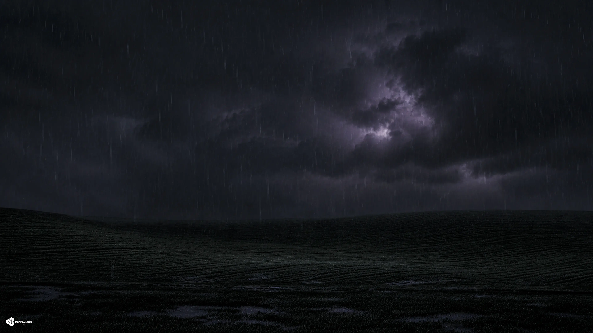

# SkyLog — Global Weather Dashboard

### Monitoramento climático em tempo real de 15 cidades ao redor do mundo

---

### Sync Ativo • Última atualização: 04:00 (BRT)
*Projeto em expansão, operando com automações no GitHub Actions para manter métricas globais atualizadas em tempo real. Consulte o link superior para a versão Web.*

 

## São Paulo, Brasil

<table>
  <tr>
    <td align="center" width="50%">
      
    </td>
    <td align="center" width="50%">
      
    </td>
  </tr>
</table>

| Parâmetro | Medição em Tempo Real |
|:---:|:---:|
| Temperatura | 11.9°C (Sensação: 10.7°C) |
| Variação Diária | 11.2°C — 23.2°C |
| Umidade / Pressão | 80% / 1017.5 hPa |
| Vento / Direção | 5.5 km/h (Direção: 316°) |
| UV / Visibilidade | 0.0 / 31.3 km |
| Condição Atual | Céu limpo |
| Horário Local | 03:59 |

### Previsão para os Próximos Dias

| Dia | Condição | Temperatura | Índice UV Máximo | Precipitação Prevista |
|:---:|:---:|:---:|:---:|:---:|
| Hoje | 🌤️ Principalmente limpo | 11.2°C a 23.2°C | UV: 5 | Precip: 0.0 mm |
| Amanhã | ⛅ Parcialmente nublado | 11.6°C a 23.8°C | UV: 5 | Precip: 0.0 mm |
| 09/06 | ☁️ Nublado | 11.8°C a 23.9°C | UV: 5 | Precip: 0.0 mm |

 
 

## Rio de Janeiro, Brasil

<table>
  <tr>
    <td align="center" width="50%">
      
    </td>
    <td align="center" width="50%">
      
    </td>
  </tr>
</table>

| Parâmetro | Medição em Tempo Real |
|:---:|:---:|
| Temperatura | 17.3°C (Sensação: 18.5°C) |
| Variação Diária | 16.4°C — 24.1°C |
| Umidade / Pressão | 88% / 1016.0 hPa |
| Vento / Direção | 3.5 km/h (Direção: 339°) |
| UV / Visibilidade | 0.0 / 25.8 km |
| Condição Atual | Principalmente limpo |
| Horário Local | 03:59 |

### Previsão para os Próximos Dias

| Dia | Condição | Temperatura | Índice UV Máximo | Precipitação Prevista |
|:---:|:---:|:---:|:---:|:---:|
| Hoje | ☁️ Nublado | 16.4°C a 24.1°C | UV: 5 | Precip: 0.0 mm |
| Amanhã | ☁️ Nublado | 16.8°C a 23.8°C | UV: 5 | Precip: 0.0 mm |
| 09/06 | ☁️ Nublado | 17.9°C a 27.0°C | UV: 4 | Precip: 0.0 mm |

 
 

## Buenos Aires, Argentina

<table>
  <tr>
    <td align="center" width="50%">
      
    </td>
    <td align="center" width="50%">
      
    </td>
  </tr>
</table>

| Parâmetro | Medição em Tempo Real |
|:---:|:---:|
| Temperatura | 14.5°C (Sensação: 14.4°C) |
| Variação Diária | 13.4°C — 15.6°C |
| Umidade / Pressão | 95% / 1018.2 hPa |
| Vento / Direção | 8.7 km/h (Direção: 120°) |
| UV / Visibilidade | 0.0 / 2.1 km |
| Condição Atual | Nublado |
| Horário Local | 03:59 |

### Previsão para os Próximos Dias

| Dia | Condição | Temperatura | Índice UV Máximo | Precipitação Prevista |
|:---:|:---:|:---:|:---:|:---:|
| Hoje | 🌦️ Chuvisco | 13.4°C a 15.6°C | UV: 2 | Precip: 1.3 mm |
| Amanhã | 🌧️ Chuva | 10.3°C a 13.1°C | UV: 1 | Precip: 25.4 mm |
| 09/06 | ☁️ Nublado | 6.6°C a 12.8°C | UV: 3 | Precip: 0.0 mm |

 
 

## Mexico City, México

<table>
  <tr>
    <td align="center" width="50%">
      
    </td>
    <td align="center" width="50%">
      
    </td>
  </tr>
</table>

| Parâmetro | Medição em Tempo Real |
|:---:|:---:|
| Temperatura | 15.5°C (Sensação: 16.7°C) |
| Variação Diária | 14.4°C — 22.2°C |
| Umidade / Pressão | 93% / 1015.0 hPa |
| Vento / Direção | 0.8 km/h (Direção: 27°) |
| UV / Visibilidade | 0.0 / 6.2 km |
| Condição Atual | Chuvisco |
| Horário Local | 00:59 |

### Previsão para os Próximos Dias

| Dia | Condição | Temperatura | Índice UV Máximo | Precipitação Prevista |
|:---:|:---:|:---:|:---:|:---:|
| Hoje | 🌧️ Chuva | 14.4°C a 22.2°C | UV: 8 | Precip: 11.9 mm |
| Amanhã | 🌦️ Chuvisco | 15.0°C a 23.0°C | UV: 9 | Precip: 5.7 mm |
| 09/06 | 🌦️ Chuvisco | 14.9°C a 24.0°C | UV: 9 | Precip: 3.5 mm |

 
 

## Havana, Cuba

<table>
  <tr>
    <td align="center" width="50%">
      
    </td>
    <td align="center" width="50%">
      
    </td>
  </tr>
</table>

| Parâmetro | Medição em Tempo Real |
|:---:|:---:|
| Temperatura | 24.6°C (Sensação: 28.5°C) |
| Variação Diária | 23.9°C — 30.8°C |
| Umidade / Pressão | 87% / 1013.3 hPa |
| Vento / Direção | 7.0 km/h (Direção: 122°) |
| UV / Visibilidade | 0.0 / 34.0 km |
| Condição Atual | Parcialmente nublado |
| Horário Local | 02:59 |

### Previsão para os Próximos Dias

| Dia | Condição | Temperatura | Índice UV Máximo | Precipitação Prevista |
|:---:|:---:|:---:|:---:|:---:|
| Hoje | 🌧️ Chuva | 23.9°C a 30.8°C | UV: 8 | Precip: 6.2 mm |
| Amanhã | ⛈️ Tempestade | 24.0°C a 31.3°C | UV: 8 | Precip: 7.3 mm |
| 09/06 | 🌦️ Chuvisco | 23.7°C a 31.5°C | UV: 8 | Precip: 2.4 mm |

 
 

## Miami, EUA

<table>
  <tr>
    <td align="center" width="50%">
      
    </td>
    <td align="center" width="50%">
      
    </td>
  </tr>
</table>

| Parâmetro | Medição em Tempo Real |
|:---:|:---:|
| Temperatura | 25.3°C (Sensação: 28.0°C) |
| Variação Diária | 24.4°C — 29.9°C |
| Umidade / Pressão | 78% / 1014.7 hPa |
| Vento / Direção | 11.8 km/h (Direção: 102°) |
| UV / Visibilidade | 0.0 / 17.3 km |
| Condição Atual | Parcialmente nublado |
| Horário Local | 02:59 |

### Previsão para os Próximos Dias

| Dia | Condição | Temperatura | Índice UV Máximo | Precipitação Prevista |
|:---:|:---:|:---:|:---:|:---:|
| Hoje | ☁️ Nublado | 24.4°C a 29.9°C | UV: 9 | Precip: 0.0 mm |
| Amanhã | ☁️ Nublado | 22.8°C a 30.5°C | UV: 9 | Precip: 0.0 mm |
| 09/06 | ☁️ Nublado | 27.1°C a 29.4°C | UV: 8 | Precip: 0.0 mm |

 
 

## New York, EUA

<table>
  <tr>
    <td align="center" width="50%">
      
    </td>
    <td align="center" width="50%">
      
    </td>
  </tr>
</table>

| Parâmetro | Medição em Tempo Real |
|:---:|:---:|
| Temperatura | 20.0°C (Sensação: 20.7°C) |
| Variação Diária | 19.4°C — 29.4°C |
| Umidade / Pressão | 88% / 1008.0 hPa |
| Vento / Direção | 15.0 km/h (Direção: 246°) |
| UV / Visibilidade | 0.0 / 14.4 km |
| Condição Atual | Céu limpo |
| Horário Local | 02:59 |

### Previsão para os Próximos Dias

| Dia | Condição | Temperatura | Índice UV Máximo | Precipitação Prevista |
|:---:|:---:|:---:|:---:|:---:|
| Hoje | ☁️ Nublado | 19.4°C a 29.4°C | UV: 8 | Precip: 0.0 mm |
| Amanhã | ☁️ Nublado | 17.2°C a 25.6°C | UV: 8 | Precip: 0.0 mm |
| 09/06 | ☁️ Nublado | 15.7°C a 26.6°C | UV: 8 | Precip: 0.0 mm |

 
 

## London, Reino Unido

<table>
  <tr>
    <td align="center" width="50%">
      
    </td>
    <td align="center" width="50%">
      
    </td>
  </tr>
</table>

| Parâmetro | Medição em Tempo Real |
|:---:|:---:|
| Temperatura | 13.8°C (Sensação: 11.5°C) |
| Variação Diária | 11.7°C — 19.4°C |
| Umidade / Pressão | 75% / 1019.2 hPa |
| Vento / Direção | 15.5 km/h (Direção: 237°) |
| UV / Visibilidade | 0.2 / 15.4 km |
| Condição Atual | Parcialmente nublado |
| Horário Local | 07:59 |

### Previsão para os Próximos Dias

| Dia | Condição | Temperatura | Índice UV Máximo | Precipitação Prevista |
|:---:|:---:|:---:|:---:|:---:|
| Hoje | 🌦️ Chuvisco | 11.7°C a 19.4°C | UV: 4 | Precip: 0.2 mm |
| Amanhã | 🌦️ Chuvisco | 13.4°C a 18.3°C | UV: 4 | Precip: 3.7 mm |
| 09/06 | 🌦️ Chuvisco | 10.6°C a 16.7°C | UV: 7 | Precip: 0.3 mm |

 
 

## Paris, França

<table>
  <tr>
    <td align="center" width="50%">
      
    </td>
    <td align="center" width="50%">
      
    </td>
  </tr>
</table>

| Parâmetro | Medição em Tempo Real |
|:---:|:---:|
| Temperatura | 13.5°C (Sensação: 11.9°C) |
| Variação Diária | 12.5°C — 21.8°C |
| Umidade / Pressão | 69% / 1024.5 hPa |
| Vento / Direção | 7.1 km/h (Direção: 240°) |
| UV / Visibilidade | 0.8 / 36.9 km |
| Condição Atual | Céu limpo |
| Horário Local | 08:59 |

### Previsão para os Próximos Dias

| Dia | Condição | Temperatura | Índice UV Máximo | Precipitação Prevista |
|:---:|:---:|:---:|:---:|:---:|
| Hoje | ☁️ Nublado | 12.5°C a 21.8°C | UV: 7 | Precip: 0.0 mm |
| Amanhã | ⛈️ Tempestade | 14.8°C a 21.6°C | UV: 6 | Precip: 1.9 mm |
| 09/06 | ☁️ Nublado | 9.3°C a 19.2°C | UV: 7 | Precip: 0.1 mm |

 
 

## Moscow, Rússia

<table>
  <tr>
    <td align="center" width="50%">
      
    </td>
    <td align="center" width="50%">
      
    </td>
  </tr>
</table>

| Parâmetro | Medição em Tempo Real |
|:---:|:---:|
| Temperatura | 22.8°C (Sensação: 23.3°C) |
| Variação Diária | 12.1°C — 26.7°C |
| Umidade / Pressão | 43% / 1019.8 hPa |
| Vento / Direção | 1.4 km/h (Direção: 180°) |
| UV / Visibilidade | 3.4 / 42.1 km |
| Condição Atual | Nublado |
| Horário Local | 09:59 |

### Previsão para os Próximos Dias

| Dia | Condição | Temperatura | Índice UV Máximo | Precipitação Prevista |
|:---:|:---:|:---:|:---:|:---:|
| Hoje | ☁️ Nublado | 12.1°C a 26.7°C | UV: 6 | Precip: 0.0 mm |
| Amanhã | ☁️ Nublado | 13.4°C a 28.1°C | UV: 6 | Precip: 0.0 mm |
| 09/06 | 🌫️ Neblina | 15.3°C a 28.4°C | UV: 6 | Precip: 0.0 mm |

 
 

## Bangkok, Tailândia

<table>
  <tr>
    <td align="center" width="50%">
      
    </td>
    <td align="center" width="50%">
      
    </td>
  </tr>
</table>

| Parâmetro | Medição em Tempo Real |
|:---:|:---:|
| Temperatura | 32.4°C (Sensação: 36.9°C) |
| Variação Diária | 28.0°C — 33.5°C |
| Umidade / Pressão | 63% / 1007.9 hPa |
| Vento / Direção | 12.1 km/h (Direção: 192°) |
| UV / Visibilidade | 8.3 / 13.2 km |
| Condição Atual | Nublado |
| Horário Local | 13:59 |

### Previsão para os Próximos Dias

| Dia | Condição | Temperatura | Índice UV Máximo | Precipitação Prevista |
|:---:|:---:|:---:|:---:|:---:|
| Hoje | ⛈️ Tempestade | 28.0°C a 33.5°C | UV: 9 | Precip: 1.8 mm |
| Amanhã | ⛈️ Tempestade | 28.1°C a 35.1°C | UV: 6 | Precip: 10.0 mm |
| 09/06 | ⛈️ Tempestade | 27.1°C a 33.2°C | UV: 8 | Precip: 7.8 mm |

 
 

## Tokyo, Japão

<table>
  <tr>
    <td align="center" width="50%">
      
    </td>
    <td align="center" width="50%">
      
    </td>
  </tr>
</table>

| Parâmetro | Medição em Tempo Real |
|:---:|:---:|
| Temperatura | 19.7°C (Sensação: 21.7°C) |
| Variação Diária | 15.6°C — 19.9°C |
| Umidade / Pressão | 82% / 1014.8 hPa |
| Vento / Direção | 1.8 km/h (Direção: 79°) |
| UV / Visibilidade | 2.5 / 3.7 km |
| Condição Atual | Nublado |
| Horário Local | 15:59 |

### Previsão para os Próximos Dias

| Dia | Condição | Temperatura | Índice UV Máximo | Precipitação Prevista |
|:---:|:---:|:---:|:---:|:---:|
| Hoje | 🌧️ Chuva | 15.6°C a 19.9°C | UV: 4 | Precip: 7.8 mm |
| Amanhã | 🌧️ Chuva | 18.4°C a 21.4°C | UV: 4 | Precip: 8.6 mm |
| 09/06 | 🌦️ Chuvisco | 18.2°C a 25.8°C | UV: 3 | Precip: 1.5 mm |

 
 

## Dubai, Emirados Árabes

<table>
  <tr>
    <td align="center" width="50%">
      
    </td>
    <td align="center" width="50%">
      
    </td>
  </tr>
</table>

| Parâmetro | Medição em Tempo Real |
|:---:|:---:|
| Temperatura | 38.3°C (Sensação: 44.4°C) |
| Variação Diária | 26.5°C — 38.5°C |
| Umidade / Pressão | 38% / 1004.5 hPa |
| Vento / Direção | 4.1 km/h (Direção: 283°) |
| UV / Visibilidade | 6.2 / 20.8 km |
| Condição Atual | Céu limpo |
| Horário Local | 10:59 |

### Previsão para os Próximos Dias

| Dia | Condição | Temperatura | Índice UV Máximo | Precipitação Prevista |
|:---:|:---:|:---:|:---:|:---:|
| Hoje | ⛈️ Tempestade | 26.5°C a 38.5°C | UV: 9 | Precip: 0.0 mm |
| Amanhã | ☀️ Céu limpo | 27.7°C a 38.4°C | UV: 9 | Precip: 0.0 mm |
| 09/06 | ☀️ Céu limpo | 29.2°C a 36.8°C | UV: 9 | Precip: 0.0 mm |

 
 

## Histórico de Dados

| Estatística | Valor |
|:---:|:---:|
| Total de registros | 2608 |
| Primeiro registro | `datetime` |
| Último registro | `2026-06-07 10:59` |
| Temperatura mais alta | **38.3°C** — Cairo |
| Temperatura mais baixa | **5.7°C** — Buenos Aires |

📂 <a href="data/history.csv">Ver histórico completo (history.csv)</a>

---

### Informações Técnicas

| Item | Detalhe |
|:---:|:---:|
| Fonte de dados | <a href="https://open-meteo.com/">Open-Meteo API</a> (gratuita) |
| Frequência | 24× ao dia (a cada hora) |
| Automação | GitHub Actions — <a href=".github/workflows/weather.yml">ver workflow</a> |
| Script | `update_weather.py` (requests e pytz) |
| Cidades Monitoradas | 15 cidades globais |

---

**Feito com amor por [Pedroxious](https://github.com/Pedroxious) · Dados: [Open-Meteo](https://open-meteo.com/)**

