# SkyLog — Global Weather Dashboard

### Monitoramento climático em tempo real de 15 cidades ao redor do mundo

---

### Sync Ativo • Última atualização: 19:53 (BRT)
*Projeto em expansão, operando com automações no GitHub Actions para manter métricas globais atualizadas em tempo real. Consulte o link superior para a versão Web.*

 

## São Paulo, Brasil

<table>
  <tr>
    <td align="center" width="50%">
      
    </td>
    <td align="center" width="50%">
      
    </td>
  </tr>
</table>

| Parâmetro | Medição em Tempo Real |
|:---:|:---:|
| Temperatura | 19.0°C (Sensação: 20.6°C) |
| Variação Diária | 16.1°C — 24.8°C |
| Umidade / Pressão | 87% / 1019.2 hPa |
| Vento / Direção | 6.2 km/h (Direção: 352°) |
| UV / Visibilidade | 0.0 / 25.1 km |
| Condição Atual | Céu limpo |
| Horário Local | 19:52 |

### Previsão para os Próximos Dias

| Dia | Condição | Temperatura | Índice UV Máximo | Precipitação Prevista |
|:---:|:---:|:---:|:---:|:---:|
| Hoje | 🌦️ Chuvisco | 16.1°C a 24.8°C | UV: 5 | Precip: 2.0 mm |
| Amanhã | 🌦️ Chuvisco | 14.7°C a 23.0°C | UV: 5 | Precip: 1.2 mm |
| 28/05 | ☁️ Nublado | 11.6°C a 19.0°C | UV: 5 | Precip: 0.0 mm |

 
 

## Rio de Janeiro, Brasil

<table>
  <tr>
    <td align="center" width="50%">
      
    </td>
    <td align="center" width="50%">
      
    </td>
  </tr>
</table>

| Parâmetro | Medição em Tempo Real |
|:---:|:---:|
| Temperatura | 22.3°C (Sensação: 24.8°C) |
| Variação Diária | 20.3°C — 25.7°C |
| Umidade / Pressão | 87% / 1018.4 hPa |
| Vento / Direção | 9.1 km/h (Direção: 72°) |
| UV / Visibilidade | 0.0 / 23.6 km |
| Condição Atual | Nublado |
| Horário Local | 19:52 |

### Previsão para os Próximos Dias

| Dia | Condição | Temperatura | Índice UV Máximo | Precipitação Prevista |
|:---:|:---:|:---:|:---:|:---:|
| Hoje | ☁️ Nublado | 20.3°C a 25.7°C | UV: 5 | Precip: 0.0 mm |
| Amanhã | 🌦️ Chuvisco | 20.1°C a 25.9°C | UV: 5 | Precip: 0.3 mm |
| 28/05 | 🌦️ Chuvisco | 19.5°C a 23.0°C | UV: 4 | Precip: 1.1 mm |

 
 

## Buenos Aires, Argentina

<table>
  <tr>
    <td align="center" width="50%">
      
    </td>
    <td align="center" width="50%">
      
    </td>
  </tr>
</table>

| Parâmetro | Medição em Tempo Real |
|:---:|:---:|
| Temperatura | 11.1°C (Sensação: 10.1°C) |
| Variação Diária | 7.2°C — 14.2°C |
| Umidade / Pressão | 94% / 1023.7 hPa |
| Vento / Direção | 7.2 km/h (Direção: 91°) |
| UV / Visibilidade | 0.0 / 1.4 km |
| Condição Atual | Céu limpo |
| Horário Local | 19:52 |

### Previsão para os Próximos Dias

| Dia | Condição | Temperatura | Índice UV Máximo | Precipitação Prevista |
|:---:|:---:|:---:|:---:|:---:|
| Hoje | ☁️ Nublado | 7.2°C a 14.2°C | UV: 4 | Precip: 0.0 mm |
| Amanhã | ☁️ Nublado | 10.4°C a 13.9°C | UV: 4 | Precip: 0.0 mm |
| 28/05 | 🌦️ Chuvisco | 13.4°C a 16.0°C | UV: 3 | Precip: 0.1 mm |

 
 

## Mexico City, México

<table>
  <tr>
    <td align="center" width="50%">
      
    </td>
    <td align="center" width="50%">
      
    </td>
  </tr>
</table>

| Parâmetro | Medição em Tempo Real |
|:---:|:---:|
| Temperatura | 21.4°C (Sensação: 20.1°C) |
| Variação Diária | 13.4°C — 25.0°C |
| Umidade / Pressão | 48% / 1011.0 hPa |
| Vento / Direção | 8.8 km/h (Direção: 287°) |
| UV / Visibilidade | 6.2 / 6.1 km |
| Condição Atual | Chuvisco |
| Horário Local | 16:53 |

### Previsão para os Próximos Dias

| Dia | Condição | Temperatura | Índice UV Máximo | Precipitação Prevista |
|:---:|:---:|:---:|:---:|:---:|
| Hoje | 🌦️ Chuvisco | 13.4°C a 25.0°C | UV: 10 | Precip: 2.3 mm |
| Amanhã | ⛈️ Tempestade | 13.4°C a 24.5°C | UV: 7 | Precip: 11.7 mm |
| 28/05 | 🌦️ Chuvisco | 11.7°C a 23.8°C | UV: 10 | Precip: 0.8 mm |

 
 

## Havana, Cuba

<table>
  <tr>
    <td align="center" width="50%">
      
    </td>
    <td align="center" width="50%">
      
    </td>
  </tr>
</table>

| Parâmetro | Medição em Tempo Real |
|:---:|:---:|
| Temperatura | 27.5°C (Sensação: 32.7°C) |
| Variação Diária | 23.5°C — 32.2°C |
| Umidade / Pressão | 82% / 1014.6 hPa |
| Vento / Direção | 5.9 km/h (Direção: 207°) |
| UV / Visibilidade | 0.8 / 6.7 km |
| Condição Atual | Chuva |
| Horário Local | 18:53 |

### Previsão para os Próximos Dias

| Dia | Condição | Temperatura | Índice UV Máximo | Precipitação Prevista |
|:---:|:---:|:---:|:---:|:---:|
| Hoje | 🌧️ Chuva | 23.5°C a 32.2°C | UV: 9 | Precip: 11.3 mm |
| Amanhã | 🌧️ Chuva | 23.4°C a 32.0°C | UV: 4 | Precip: 8.1 mm |
| 28/05 | ⛈️ Tempestade | 23.0°C a 30.9°C | UV: 7 | Precip: 7.9 mm |

 
 

## Miami, EUA

<table>
  <tr>
    <td align="center" width="50%">
      
    </td>
    <td align="center" width="50%">
      
    </td>
  </tr>
</table>

| Parâmetro | Medição em Tempo Real |
|:---:|:---:|
| Temperatura | 28.0°C (Sensação: 32.3°C) |
| Variação Diária | 24.8°C — 30.3°C |
| Umidade / Pressão | 81% / 1016.7 hPa |
| Vento / Direção | 13.8 km/h (Direção: 75°) |
| UV / Visibilidade | 3.4 / 18.2 km |
| Condição Atual | Nublado |
| Horário Local | 18:53 |

### Previsão para os Próximos Dias

| Dia | Condição | Temperatura | Índice UV Máximo | Precipitação Prevista |
|:---:|:---:|:---:|:---:|:---:|
| Hoje | ⛈️ Tempestade | 24.8°C a 30.3°C | UV: 9 | Precip: 16.6 mm |
| Amanhã | ☁️ Nublado | 24.8°C a 30.7°C | UV: 9 | Precip: 0.0 mm |
| 28/05 | ⛈️ Tempestade | 25.0°C a 29.5°C | UV: 7 | Precip: 21.7 mm |

 
 

## New York, EUA

<table>
  <tr>
    <td align="center" width="50%">
      
    </td>
    <td align="center" width="50%">
      
    </td>
  </tr>
</table>

| Parâmetro | Medição em Tempo Real |
|:---:|:---:|
| Temperatura | 23.9°C (Sensação: 22.6°C) |
| Variação Diária | 14.6°C — 27.3°C |
| Umidade / Pressão | 48% / 1016.5 hPa |
| Vento / Direção | 13.2 km/h (Direção: 158°) |
| UV / Visibilidade | 2.6 / 42.3 km |
| Condição Atual | Nublado |
| Horário Local | 18:53 |

### Previsão para os Próximos Dias

| Dia | Condição | Temperatura | Índice UV Máximo | Precipitação Prevista |
|:---:|:---:|:---:|:---:|:---:|
| Hoje | ☁️ Nublado | 14.6°C a 27.3°C | UV: 8 | Precip: 0.0 mm |
| Amanhã | ☁️ Nublado | 17.5°C a 30.3°C | UV: 6 | Precip: 0.0 mm |
| 28/05 | 🌦️ Chuvisco | 15.8°C a 23.6°C | UV: 7 | Precip: 0.4 mm |

 
 

## London, Reino Unido

<table>
  <tr>
    <td align="center" width="50%">
      
    </td>
    <td align="center" width="50%">
      
    </td>
  </tr>
</table>

| Parâmetro | Medição em Tempo Real |
|:---:|:---:|
| Temperatura | 27.4°C (Sensação: 27.8°C) |
| Variação Diária | 21.3°C — 34.6°C |
| Umidade / Pressão | 43% / 1024.6 hPa |
| Vento / Direção | 5.0 km/h (Direção: 2°) |
| UV / Visibilidade | 0.0 / 22.6 km |
| Condição Atual | Céu limpo |
| Horário Local | 23:53 |

### Previsão para os Próximos Dias

| Dia | Condição | Temperatura | Índice UV Máximo | Precipitação Prevista |
|:---:|:---:|:---:|:---:|:---:|
| Hoje | 🌤️ Principalmente limpo | 21.3°C a 34.6°C | UV: 5 | Precip: 0.0 mm |
| Amanhã | ☁️ Nublado | 17.4°C a 27.2°C | UV: 6 | Precip: 0.0 mm |
| 28/05 | 🌦️ Chuvisco | 16.5°C a 31.4°C | UV: 5 | Precip: 0.2 mm |

 
 

## Paris, França

<table>
  <tr>
    <td align="center" width="50%">
      
    </td>
    <td align="center" width="50%">
      
    </td>
  </tr>
</table>

| Parâmetro | Medição em Tempo Real |
|:---:|:---:|
| Temperatura | 24.1°C (Sensação: 25.1°C) |
| Variação Diária | 20.4°C — 32.3°C |
| Umidade / Pressão | 55% / 1024.2 hPa |
| Vento / Direção | 3.2 km/h (Direção: 333°) |
| UV / Visibilidade | 0.0 / 41.0 km |
| Condição Atual | Céu limpo |
| Horário Local | 00:53 |

### Previsão para os Próximos Dias

| Dia | Condição | Temperatura | Índice UV Máximo | Precipitação Prevista |
|:---:|:---:|:---:|:---:|:---:|
| Hoje | 🌤️ Principalmente limpo | 20.4°C a 32.3°C | UV: 7 | Precip: 0.0 mm |
| Amanhã | ☁️ Nublado | 20.4°C a 32.5°C | UV: 7 | Precip: 0.0 mm |
| 29/05 | ☁️ Nublado | 20.9°C a 33.7°C | UV: 7 | Precip: 0.0 mm |

 
 

## Moscow, Rússia

<table>
  <tr>
    <td align="center" width="50%">
      
    </td>
    <td align="center" width="50%">
      
    </td>
  </tr>
</table>

| Parâmetro | Medição em Tempo Real |
|:---:|:---:|
| Temperatura | 8.0°C (Sensação: 5.7°C) |
| Variação Diária | 7.2°C — 13.9°C |
| Umidade / Pressão | 83% / 1000.1 hPa |
| Vento / Direção | 7.8 km/h (Direção: 257°) |
| UV / Visibilidade | 0.0 / 29.5 km |
| Condição Atual | Parcialmente nublado |
| Horário Local | 01:53 |

### Previsão para os Próximos Dias

| Dia | Condição | Temperatura | Índice UV Máximo | Precipitação Prevista |
|:---:|:---:|:---:|:---:|:---:|
| Hoje | ⛈️ Tempestade | 7.2°C a 13.9°C | UV: 5 | Precip: 2.8 mm |
| Amanhã | 🌧️ Chuva | 6.2°C a 11.4°C | UV: 4 | Precip: 1.6 mm |
| 29/05 | 🌧️ Chuva | 4.9°C a 10.9°C | UV: 4 | Precip: 0.5 mm |

 
 

## Bangkok, Tailândia

<table>
  <tr>
    <td align="center" width="50%">
      
    </td>
    <td align="center" width="50%">
      
    </td>
  </tr>
</table>

| Parâmetro | Medição em Tempo Real |
|:---:|:---:|
| Temperatura | 26.8°C (Sensação: 32.9°C) |
| Variação Diária | 26.9°C — 34.6°C |
| Umidade / Pressão | 90% / 1008.7 hPa |
| Vento / Direção | 3.9 km/h (Direção: 242°) |
| UV / Visibilidade | 0.0 / 22.1 km |
| Condição Atual | Céu limpo |
| Horário Local | 05:53 |

### Previsão para os Próximos Dias

| Dia | Condição | Temperatura | Índice UV Máximo | Precipitação Prevista |
|:---:|:---:|:---:|:---:|:---:|
| Hoje | ⛈️ Tempestade | 26.9°C a 34.6°C | UV: 9 | Precip: 2.5 mm |
| Amanhã | ⛈️ Tempestade | 26.9°C a 34.2°C | UV: 8 | Precip: 3.0 mm |
| 29/05 | ⛈️ Tempestade | 26.6°C a 33.6°C | UV: 9 | Precip: 6.0 mm |

 
 

## Tokyo, Japão

<table>
  <tr>
    <td align="center" width="50%">
      
    </td>
    <td align="center" width="50%">
      
    </td>
  </tr>
</table>

| Parâmetro | Medição em Tempo Real |
|:---:|:---:|
| Temperatura | 19.9°C (Sensação: 22.6°C) |
| Variação Diária | 17.2°C — 26.3°C |
| Umidade / Pressão | 91% / 1013.4 hPa |
| Vento / Direção | 3.0 km/h (Direção: 346°) |
| UV / Visibilidade | 1.6 / 10.9 km |
| Condição Atual | Parcialmente nublado |
| Horário Local | 07:53 |

### Previsão para os Próximos Dias

| Dia | Condição | Temperatura | Índice UV Máximo | Precipitação Prevista |
|:---:|:---:|:---:|:---:|:---:|
| Hoje | ☁️ Nublado | 17.2°C a 26.3°C | UV: 7 | Precip: 0.0 mm |
| Amanhã | 🌦️ Chuvisco | 19.5°C a 23.0°C | UV: 3 | Precip: 0.2 mm |
| 29/05 | ☁️ Nublado | 18.7°C a 30.4°C | UV: 7 | Precip: 0.0 mm |

 
 

## Dubai, Emirados Árabes

<table>
  <tr>
    <td align="center" width="50%">
      
    </td>
    <td align="center" width="50%">
      
    </td>
  </tr>
</table>

| Parâmetro | Medição em Tempo Real |
|:---:|:---:|
| Temperatura | 27.4°C (Sensação: 31.9°C) |
| Variação Diária | 26.4°C — 36.7°C |
| Umidade / Pressão | 81% / 1004.8 hPa |
| Vento / Direção | 9.5 km/h (Direção: 190°) |
| UV / Visibilidade | 0.0 / 14.5 km |
| Condição Atual | Céu limpo |
| Horário Local | 02:53 |

### Previsão para os Próximos Dias

| Dia | Condição | Temperatura | Índice UV Máximo | Precipitação Prevista |
|:---:|:---:|:---:|:---:|:---:|
| Hoje | ⛈️ Tempestade | 26.4°C a 36.7°C | UV: 9 | Precip: 0.0 mm |
| Amanhã | ⛈️ Tempestade | 26.4°C a 36.5°C | UV: 9 | Precip: 0.0 mm |
| 29/05 | ⛈️ Tempestade | 26.0°C a 39.0°C | UV: 9 | Precip: 0.0 mm |

 
 

## Cairo, Egito

<table>
  <tr>
    <td align="center" width="50%">
      
    </td>
    <td align="center" width="50%">
      
    </td>
  </tr>
</table>

| Parâmetro | Medição em Tempo Real |
|:---:|:---:|
| Temperatura | 20.7°C (Sensação: 21.6°C) |
| Variação Diária | 18.7°C — 30.7°C |
| Umidade / Pressão | 74% / 1014.7 hPa |
| Vento / Direção | 7.6 km/h (Direção: 8°) |
| UV / Visibilidade | 0.0 / 34.9 km |
| Condição Atual | Céu limpo |
| Horário Local | 01:53 |

### Previsão para os Próximos Dias

| Dia | Condição | Temperatura | Índice UV Máximo | Precipitação Prevista |
|:---:|:---:|:---:|:---:|:---:|
| Hoje | ☁️ Nublado | 18.7°C a 30.7°C | UV: 8 | Precip: 0.0 mm |
| Amanhã | ☁️ Nublado | 19.2°C a 32.1°C | UV: 8 | Precip: 0.0 mm |
| 29/05 | 🌤️ Principalmente limpo | 19.7°C a 32.7°C | UV: 8 | Precip: 0.0 mm |

 
 

## Sydney, Austrália

<table>
  <tr>
    <td align="center" width="50%">
      
    </td>
    <td align="center" width="50%">
      
    </td>
  </tr>
</table>

| Parâmetro | Medição em Tempo Real |
|:---:|:---:|
| Temperatura | 15.2°C (Sensação: 16.2°C) |
| Variação Diária | 14.7°C — 20.5°C |
| Umidade / Pressão | 100% / 1019.4 hPa |
| Vento / Direção | 5.2 km/h (Direção: 268°) |
| UV / Visibilidade | 0.3 / 0.1 km |
| Condição Atual | Nublado |
| Horário Local | 08:53 |

### Previsão para os Próximos Dias

| Dia | Condição | Temperatura | Índice UV Máximo | Precipitação Prevista |
|:---:|:---:|:---:|:---:|:---:|
| Hoje | 🌧️ Chuva | 14.7°C a 20.5°C | UV: 4 | Precip: 7.3 mm |
| Amanhã | 🌧️ Chuva | 16.4°C a 19.2°C | UV: 4 | Precip: 6.8 mm |
| 29/05 | 🌧️ Chuva | 14.6°C a 18.8°C | UV: 1 | Precip: 14.7 mm |

 
 

## Histórico de Dados

| Estatística | Valor |
|:---:|:---:|
| Total de registros | 675 |
| Primeiro registro | `2026-05-17 19:38` |
| Último registro | `2026-05-27 08:53` |
| Temperatura mais alta | **38.0°C** — Dubai |
| Temperatura mais baixa | **5.7°C** — Buenos Aires |

📂 <a href="data/history.csv">Ver histórico completo (history.csv)</a>

---

### Informações Técnicas

| Item | Detalhe |
|:---:|:---:|
| Fonte de dados | <a href="https://open-meteo.com/">Open-Meteo API</a> (gratuita) |
| Frequência | 24× ao dia (a cada hora) |
| Automação | GitHub Actions — <a href=".github/workflows/weather.yml">ver workflow</a> |
| Script | `update_weather.py` (requests e pytz) |
| Cidades Monitoradas | 15 cidades globais |

---

**Feito com amor por [Pedroxious](https://github.com/Pedroxious) · Dados: [Open-Meteo](https://open-meteo.com/)**

