# 🌍 SkyLog — Global Weather Dashboard

### Monitoramento climático em tempo real de 12 cidades ao redor do mundo

---

### Sync Ativo • Última atualização: 17:54 (BRT)
*Projeto em expansão, operando com automações no GitHub Actions para manter métricas globais atualizadas em tempo real. Consulte a aba superior para a versão Web.*

 

## 🏙️ São Paulo, Brasil

<table>
  <tr>
    <td align="center" width="50%">
      
    </td>
    <td align="center" width="50%">
      
    </td>
  </tr>
</table>

| Parâmetro | Medição em Tempo Real |
|:---:|:---:|
| **Temperatura** | 18.5°C (Sensação: 21.0°C) |
| **Variação (Mín/Máx)** | 15.2°C — 23.8°C |
| **Umidade** | 94% |
| **Vento** | 1.4 km/h |
| **Condição Atual** | Chuvisco |
| **Horário Local** | 17:54 |

 
 

## 🏙️ Rio de Janeiro, Brasil

<table>
  <tr>
    <td align="center" width="50%">
      
    </td>
    <td align="center" width="50%">
      
    </td>
  </tr>
</table>

| Parâmetro | Medição em Tempo Real |
|:---:|:---:|
| **Temperatura** | 22.4°C (Sensação: 25.5°C) |
| **Variação (Mín/Máx)** | 20.3°C — 25.2°C |
| **Umidade** | 90% |
| **Vento** | 7.5 km/h |
| **Condição Atual** | Nublado |
| **Horário Local** | 17:54 |

 
 

## 🏙️ Buenos Aires, Argentina

<table>
  <tr>
    <td align="center" width="50%">
      
    </td>
    <td align="center" width="50%">
      
    </td>
  </tr>
</table>

| Parâmetro | Medição em Tempo Real |
|:---:|:---:|
| **Temperatura** | 13.4°C (Sensação: 13.4°C) |
| **Variação (Mín/Máx)** | 9.9°C — 14.4°C |
| **Umidade** | 87% |
| **Vento** | 2.3 km/h |
| **Condição Atual** | Nublado |
| **Horário Local** | 17:54 |

 
 

## 🏙️ Mexico City, México

<table>
  <tr>
    <td align="center" width="50%">
      
    </td>
    <td align="center" width="50%">
      
    </td>
  </tr>
</table>

| Parâmetro | Medição em Tempo Real |
|:---:|:---:|
| **Temperatura** | 24.2°C (Sensação: 23.1°C) |
| **Variação (Mín/Máx)** | 12.1°C — 25.1°C |
| **Umidade** | 34% |
| **Vento** | 10.5 km/h |
| **Condição Atual** | Chuvisco |
| **Horário Local** | 14:54 |

 
 

## 🏙️ New York, EUA

<table>
  <tr>
    <td align="center" width="50%">
      
    </td>
    <td align="center" width="50%">
      
    </td>
  </tr>
</table>

| Parâmetro | Medição em Tempo Real |
|:---:|:---:|
| **Temperatura** | 14.2°C (Sensação: 13.5°C) |
| **Variação (Mín/Máx)** | 10.2°C — 14.4°C |
| **Umidade** | 94% |
| **Vento** | 12.2 km/h |
| **Condição Atual** | Nublado |
| **Horário Local** | 16:54 |

 
 

## 🏙️ San Francisco, EUA

<table>
  <tr>
    <td align="center" width="50%">
      
    </td>
    <td align="center" width="50%">
      
    </td>
  </tr>
</table>

| Parâmetro | Medição em Tempo Real |
|:---:|:---:|
| **Temperatura** | 17.0°C (Sensação: 16.5°C) |
| **Variação (Mín/Máx)** | 11.8°C — 17.5°C |
| **Umidade** | 71% |
| **Vento** | 20.3 km/h |
| **Condição Atual** | Céu limpo |
| **Horário Local** | 13:54 |

 
 

## 🏙️ London, Reino Unido

<table>
  <tr>
    <td align="center" width="50%">
      
    </td>
    <td align="center" width="50%">
      
    </td>
  </tr>
</table>

| Parâmetro | Medição em Tempo Real |
|:---:|:---:|
| **Temperatura** | 26.2°C (Sensação: 27.1°C) |
| **Variação (Mín/Máx)** | 16.6°C — 31.4°C |
| **Umidade** | 56% |
| **Vento** | 9.7 km/h |
| **Condição Atual** | Céu limpo |
| **Horário Local** | 21:54 |

 
 

## 🏙️ Paris, França

<table>
  <tr>
    <td align="center" width="50%">
      
    </td>
    <td align="center" width="50%">
      
    </td>
  </tr>
</table>

| Parâmetro | Medição em Tempo Real |
|:---:|:---:|
| **Temperatura** | 27.2°C (Sensação: 28.4°C) |
| **Variação (Mín/Máx)** | 18.9°C — 32.6°C |
| **Umidade** | 52% |
| **Vento** | 6.9 km/h |
| **Condição Atual** | Parcialmente nublado |
| **Horário Local** | 22:54 |

 
 

## 🏙️ Tokyo, Japão

<table>
  <tr>
    <td align="center" width="50%">
      
    </td>
    <td align="center" width="50%">
      
    </td>
  </tr>
</table>

| Parâmetro | Medição em Tempo Real |
|:---:|:---:|
| **Temperatura** | 16.1°C (Sensação: 17.3°C) |
| **Variação (Mín/Máx)** | 15.6°C — 26.1°C |
| **Umidade** | 94% |
| **Vento** | 3.3 km/h |
| **Condição Atual** | Principalmente limpo |
| **Horário Local** | 05:54 |

 
 

## 🏙️ Dubai, Emirados Árabes

<table>
  <tr>
    <td align="center" width="50%">
      
    </td>
    <td align="center" width="50%">
      
    </td>
  </tr>
</table>

| Parâmetro | Medição em Tempo Real |
|:---:|:---:|
| **Temperatura** | 27.5°C (Sensação: 34.2°C) |
| **Variação (Mín/Máx)** | 24.7°C — 37.8°C |
| **Umidade** | 88% |
| **Vento** | 1.5 km/h |
| **Condição Atual** | Céu limpo |
| **Horário Local** | 00:54 |

 
 

 

    <i>🚀 Novas cidades da Ásia e Europa estão planejadas para as próximas atualizações. Fique ligado!</i>

## 📊 Histórico de Dados

| Estatística | Valor |
|:---:|:---:|
| **Total de registros** | 636 |
| **Primeiro registro** | `2026-05-17 19:38` |
| **Último registro** | `2026-05-25 00:54` |
| **Temperatura mais alta** | **38.0°C** — Dubai |
| **Temperatura mais baixa** | **5.7°C** — Buenos Aires |

📂 <a href="data/history.csv">Ver histórico completo (history.csv)</a>

---

### ⚙️ Informações Técnicas

| Item | Detalhe |
|:---:|:---:|
| **Fonte de dados** | <a href="https://open-meteo.com/">Open-Meteo API</a> (gratuita) |
| **Frequência** | 12× ao dia (a cada 2 horas dia e noite) |
| **Automação** | GitHub Actions — <a href=".github/workflows/weather.yml">ver workflow</a> |
| **Script** | `update_weather.py` (requests e pytz) |
| **Cidades Monitoradas** | 12 cidades globais |

---

**Feito com 💙 por [Pedroxious](https://github.com/Pedroxious) · Dados: [Open-Meteo](https://open-meteo.com/)**

