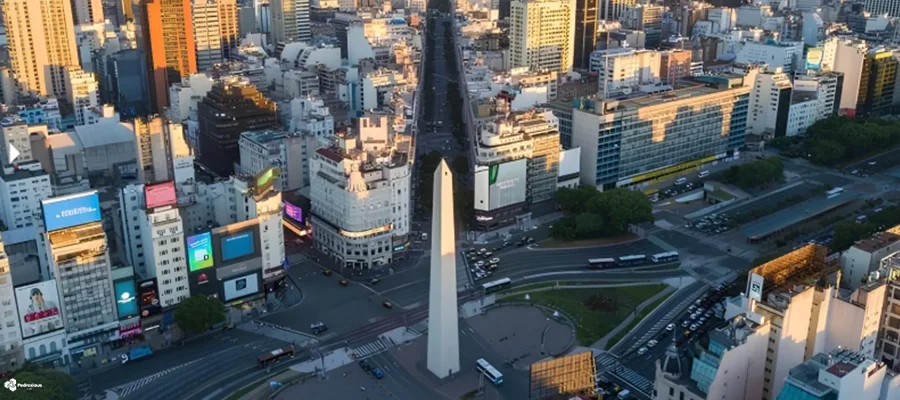
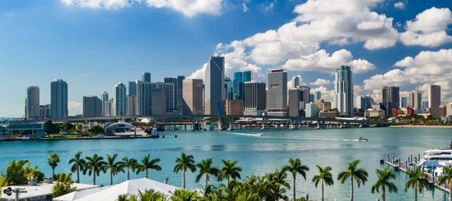

# SkyLog — Global Weather Dashboard

### Monitoramento climático em tempo real de 15 cidades ao redor do mundo

---

### Sync Ativo • Última atualização: 03:52 (BRT)
*Projeto em expansão, operando com automações no GitHub Actions para manter métricas globais atualizadas em tempo real. Consulte o link superior para a versão Web.*

 

## São Paulo, Brasil

<table>
  <tr>
    <td align="center" width="50%">
      
    </td>
    <td align="center" width="50%">
      
    </td>
  </tr>
</table>

| Parâmetro | Medição em Tempo Real |
|:---:|:---:|
| Temperatura | 16.5°C (Sensação: 15.6°C) |
| Variação Diária | 15.9°C — 21.3°C |
| Umidade / Pressão | 93% / 1014.5 hPa |
| Vento / Direção | 17.8 km/h (Direção: 322°) |
| UV / Visibilidade | 0.0 / 11.9 km |
| Condição Atual | Nublado |
| Horário Local | 03:51 |

### Previsão para os Próximos Dias

| Dia | Condição | Temperatura | Índice UV Máximo | Precipitação Prevista |
|:---:|:---:|:---:|:---:|:---:|
| Hoje | 🌦️ Chuvisco | 15.9°C a 21.3°C | UV: 5 | Precip: 2.4 mm |
| Amanhã | 🌦️ Chuvisco | 15.7°C a 22.3°C | UV: 4 | Precip: 1.2 mm |
| 15/06 | 🌧️ Chuva | 14.0°C a 17.4°C | UV: 1 | Precip: 8.6 mm |

 
 

## Rio de Janeiro, Brasil

<table>
  <tr>
    <td align="center" width="50%">
      
    </td>
    <td align="center" width="50%">
      
    </td>
  </tr>
</table>

| Parâmetro | Medição em Tempo Real |
|:---:|:---:|
| Temperatura | 21.3°C (Sensação: 22.0°C) |
| Variação Diária | 21.1°C — 26.6°C |
| Umidade / Pressão | 80% / 1011.3 hPa |
| Vento / Direção | 14.0 km/h (Direção: 344°) |
| UV / Visibilidade | 0.0 / 29.9 km |
| Condição Atual | Parcialmente nublado |
| Horário Local | 03:51 |

### Previsão para os Próximos Dias

| Dia | Condição | Temperatura | Índice UV Máximo | Precipitação Prevista |
|:---:|:---:|:---:|:---:|:---:|
| Hoje | 🌦️ Chuvisco | 21.1°C a 26.6°C | UV: 5 | Precip: 0.6 mm |
| Amanhã | 🌦️ Chuvisco | 20.2°C a 24.1°C | UV: 4 | Precip: 2.7 mm |
| 15/06 | 🌦️ Chuvisco | 19.9°C a 22.3°C | UV: 4 | Precip: 8.1 mm |

 
 

## Buenos Aires, Argentina

<table>
  <tr>
    <td align="center" width="50%">
      
    </td>
    <td align="center" width="50%">
      
    </td>
  </tr>
</table>

| Parâmetro | Medição em Tempo Real |
|:---:|:---:|
| Temperatura | 9.6°C (Sensação: 7.9°C) |
| Variação Diária | 7.5°C — 15.5°C |
| Umidade / Pressão | 93% / 1015.2 hPa |
| Vento / Direção | 8.7 km/h (Direção: 302°) |
| UV / Visibilidade | 0.0 / 18.6 km |
| Condição Atual | Céu limpo |
| Horário Local | 03:51 |

### Previsão para os Próximos Dias

| Dia | Condição | Temperatura | Índice UV Máximo | Precipitação Prevista |
|:---:|:---:|:---:|:---:|:---:|
| Hoje | 🌦️ Chuvisco | 7.5°C a 15.5°C | UV: 3 | Precip: 2.1 mm |
| Amanhã | 🌦️ Chuvisco | 3.3°C a 9.7°C | UV: 3 | Precip: 0.1 mm |
| 15/06 | ☀️ Céu limpo | 2.7°C a 12.3°C | UV: 3 | Precip: 0.0 mm |

 
 

## Mexico City, México

<table>
  <tr>
    <td align="center" width="50%">
      
    </td>
    <td align="center" width="50%">
      
    </td>
  </tr>
</table>

| Parâmetro | Medição em Tempo Real |
|:---:|:---:|
| Temperatura | 14.8°C (Sensação: 15.6°C) |
| Variação Diária | 14.3°C — 21.9°C |
| Umidade / Pressão | 93% / 1017.2 hPa |
| Vento / Direção | 2.2 km/h (Direção: 90°) |
| UV / Visibilidade | 0.0 / 16.1 km |
| Condição Atual | Nublado |
| Horário Local | 00:51 |

### Previsão para os Próximos Dias

| Dia | Condição | Temperatura | Índice UV Máximo | Precipitação Prevista |
|:---:|:---:|:---:|:---:|:---:|
| Hoje | 🌧️ Chuva | 14.3°C a 21.9°C | UV: 10 | Precip: 5.4 mm |
| Amanhã | 🌧️ Chuva | 13.1°C a 24.1°C | UV: 8 | Precip: 4.1 mm |
| 15/06 | 🌦️ Chuvisco | 12.8°C a 24.1°C | UV: 6 | Precip: 0.3 mm |

 
 

## Havana, Cuba

<table>
  <tr>
    <td align="center" width="50%">
      
    </td>
    <td align="center" width="50%">
      
    </td>
  </tr>
</table>

| Parâmetro | Medição em Tempo Real |
|:---:|:---:|
| Temperatura | 25.2°C (Sensação: 30.0°C) |
| Variação Diária | 24.5°C — 31.0°C |
| Umidade / Pressão | 88% / 1016.0 hPa |
| Vento / Direção | 5.1 km/h (Direção: 129°) |
| UV / Visibilidade | 0.0 / 33.7 km |
| Condição Atual | Nublado |
| Horário Local | 02:51 |

### Previsão para os Próximos Dias

| Dia | Condição | Temperatura | Índice UV Máximo | Precipitação Prevista |
|:---:|:---:|:---:|:---:|:---:|
| Hoje | 🌧️ Chuva | 24.5°C a 31.0°C | UV: 9 | Precip: 3.2 mm |
| Amanhã | 🌧️ Chuva | 23.6°C a 31.6°C | UV: 9 | Precip: 5.3 mm |
| 15/06 | ⛈️ Tempestade | 23.9°C a 30.9°C | UV: 9 | Precip: 9.7 mm |

 
 

## Miami, EUA

<table>
  <tr>
    <td align="center" width="50%">
      
    </td>
    <td align="center" width="50%">
      
    </td>
  </tr>
</table>

| Parâmetro | Medição em Tempo Real |
|:---:|:---:|
| Temperatura | 24.5°C (Sensação: 28.5°C) |
| Variação Diária | 23.3°C — 31.7°C |
| Umidade / Pressão | 87% / 1016.1 hPa |
| Vento / Direção | 6.5 km/h (Direção: 304°) |
| UV / Visibilidade | 0.0 / 14.7 km |
| Condição Atual | Nublado |
| Horário Local | 02:51 |

### Previsão para os Próximos Dias

| Dia | Condição | Temperatura | Índice UV Máximo | Precipitação Prevista |
|:---:|:---:|:---:|:---:|:---:|
| Hoje | ☁️ Nublado | 23.3°C a 31.7°C | UV: 9 | Precip: 0.0 mm |
| Amanhã | ⛈️ Tempestade | 23.4°C a 31.6°C | UV: 9 | Precip: 10.6 mm |
| 15/06 | ⛈️ Tempestade | 27.6°C a 31.4°C | UV: 8 | Precip: 13.7 mm |

 
 

## New York, EUA

<table>
  <tr>
    <td align="center" width="50%">
      
    </td>
    <td align="center" width="50%">
      
    </td>
  </tr>
</table>

| Parâmetro | Medição em Tempo Real |
|:---:|:---:|
| Temperatura | 22.7°C (Sensação: 23.0°C) |
| Variação Diária | 19.4°C — 32.9°C |
| Umidade / Pressão | 72% / 1008.8 hPa |
| Vento / Direção | 16.1 km/h (Direção: 320°) |
| UV / Visibilidade | 0.0 / 21.8 km |
| Condição Atual | Nublado |
| Horário Local | 02:51 |

### Previsão para os Próximos Dias

| Dia | Condição | Temperatura | Índice UV Máximo | Precipitação Prevista |
|:---:|:---:|:---:|:---:|:---:|
| Hoje | ☁️ Nublado | 19.4°C a 32.9°C | UV: 8 | Precip: 0.0 mm |
| Amanhã | 🌧️ Chuva | 18.9°C a 32.6°C | UV: 7 | Precip: 15.9 mm |
| 15/06 | 🌦️ Chuvisco | 16.6°C a 25.6°C | UV: 8 | Precip: 0.2 mm |

 
 

## London, Reino Unido

<table>
  <tr>
    <td align="center" width="50%">
      
    </td>
    <td align="center" width="50%">
      
    </td>
  </tr>
</table>

| Parâmetro | Medição em Tempo Real |
|:---:|:---:|
| Temperatura | 14.7°C (Sensação: 12.0°C) |
| Variação Diária | 13.3°C — 21.7°C |
| Umidade / Pressão | 69% / 1021.7 hPa |
| Vento / Direção | 16.6 km/h (Direção: 272°) |
| UV / Visibilidade | 0.2 / 17.0 km |
| Condição Atual | Principalmente limpo |
| Horário Local | 07:51 |

### Previsão para os Próximos Dias

| Dia | Condição | Temperatura | Índice UV Máximo | Precipitação Prevista |
|:---:|:---:|:---:|:---:|:---:|
| Hoje | ☁️ Nublado | 13.3°C a 21.7°C | UV: 5 | Precip: 0.0 mm |
| Amanhã | 🌦️ Chuvisco | 13.2°C a 21.2°C | UV: 6 | Precip: 1.1 mm |
| 15/06 | ☁️ Nublado | 12.8°C a 22.0°C | UV: 7 | Precip: 0.2 mm |

 
 

## Paris, França

<table>
  <tr>
    <td align="center" width="50%">
      
    </td>
    <td align="center" width="50%">
      
    </td>
  </tr>
</table>

| Parâmetro | Medição em Tempo Real |
|:---:|:---:|
| Temperatura | 16.6°C (Sensação: 16.0°C) |
| Variação Diária | 16.3°C — 26.7°C |
| Umidade / Pressão | 78% / 1024.7 hPa |
| Vento / Direção | 9.7 km/h (Direção: 285°) |
| UV / Visibilidade | 0.5 / 30.9 km |
| Condição Atual | Parcialmente nublado |
| Horário Local | 08:51 |

### Previsão para os Próximos Dias

| Dia | Condição | Temperatura | Índice UV Máximo | Precipitação Prevista |
|:---:|:---:|:---:|:---:|:---:|
| Hoje | ☁️ Nublado | 16.3°C a 26.7°C | UV: 7 | Precip: 0.0 mm |
| Amanhã | 🌤️ Principalmente limpo | 14.7°C a 26.4°C | UV: 7 | Precip: 0.0 mm |
| 15/06 | 🌧️ Chuva | 14.9°C a 26.1°C | UV: 7 | Precip: 0.2 mm |

 
 

## Moscow, Rússia

<table>
  <tr>
    <td align="center" width="50%">
      
    </td>
    <td align="center" width="50%">
      
    </td>
  </tr>
</table>

| Parâmetro | Medição em Tempo Real |
|:---:|:---:|
| Temperatura | 26.5°C (Sensação: 28.3°C) |
| Variação Diária | 18.0°C — 27.4°C |
| Umidade / Pressão | 55% / 1009.0 hPa |
| Vento / Direção | 6.8 km/h (Direção: 115°) |
| UV / Visibilidade | 3.2 / 40.4 km |
| Condição Atual | Nublado |
| Horário Local | 09:51 |

### Previsão para os Próximos Dias

| Dia | Condição | Temperatura | Índice UV Máximo | Precipitação Prevista |
|:---:|:---:|:---:|:---:|:---:|
| Hoje | 🌧️ Chuva | 18.0°C a 27.4°C | UV: 6 | Precip: 1.5 mm |
| Amanhã | ⛈️ Tempestade | 12.9°C a 18.9°C | UV: 5 | Precip: 16.9 mm |
| 15/06 | ⛈️ Tempestade | 11.9°C a 23.1°C | UV: 5 | Precip: 6.6 mm |

 
 

## Bangkok, Tailândia

<table>
  <tr>
    <td align="center" width="50%">
      
    </td>
    <td align="center" width="50%">
      
    </td>
  </tr>
</table>

| Parâmetro | Medição em Tempo Real |
|:---:|:---:|
| Temperatura | 32.5°C (Sensação: 39.4°C) |
| Variação Diária | 25.6°C — 32.7°C |
| Umidade / Pressão | 60% / 1009.1 hPa |
| Vento / Direção | 6.8 km/h (Direção: 198°) |
| UV / Visibilidade | 8.9 / 5.0 km |
| Condição Atual | Chuvisco |
| Horário Local | 13:51 |

### Previsão para os Próximos Dias

| Dia | Condição | Temperatura | Índice UV Máximo | Precipitação Prevista |
|:---:|:---:|:---:|:---:|:---:|
| Hoje | 🌦️ Chuvisco | 25.6°C a 32.7°C | UV: 9 | Precip: 3.6 mm |
| Amanhã | ⛈️ Tempestade | 25.8°C a 31.9°C | UV: 9 | Precip: 10.2 mm |
| 15/06 | ⛈️ Tempestade | 26.3°C a 31.8°C | UV: 7 | Precip: 6.9 mm |

 
 

## Tokyo, Japão

<table>
  <tr>
    <td align="center" width="50%">
      
    </td>
    <td align="center" width="50%">
      
    </td>
  </tr>
</table>

| Parâmetro | Medição em Tempo Real |
|:---:|:---:|
| Temperatura | 26.7°C (Sensação: 28.5°C) |
| Variação Diária | 17.0°C — 27.4°C |
| Umidade / Pressão | 59% / 1012.3 hPa |
| Vento / Direção | 8.0 km/h (Direção: 190°) |
| UV / Visibilidade | 5.8 / 7.3 km |
| Condição Atual | Céu limpo |
| Horário Local | 15:51 |

### Previsão para os Próximos Dias

| Dia | Condição | Temperatura | Índice UV Máximo | Precipitação Prevista |
|:---:|:---:|:---:|:---:|:---:|
| Hoje | ⛅ Parcialmente nublado | 17.0°C a 27.4°C | UV: 8 | Precip: 0.0 mm |
| Amanhã | ☁️ Nublado | 19.2°C a 26.6°C | UV: 6 | Precip: 0.0 mm |
| 15/06 | 🌧️ Chuva | 17.0°C a 20.2°C | UV: 1 | Precip: 24.9 mm |

 
 

## Dubai, Emirados Árabes

<table>
  <tr>
    <td align="center" width="50%">
      
    </td>
    <td align="center" width="50%">
      
    </td>
  </tr>
</table>

| Parâmetro | Medição em Tempo Real |
|:---:|:---:|
| Temperatura | 35.7°C (Sensação: 42.1°C) |
| Variação Diária | 26.6°C — 36.4°C |
| Umidade / Pressão | 49% / 1002.8 hPa |
| Vento / Direção | 8.7 km/h (Direção: 283°) |
| UV / Visibilidade | 6.1 / 19.1 km |
| Condição Atual | Céu limpo |
| Horário Local | 10:51 |

### Previsão para os Próximos Dias

| Dia | Condição | Temperatura | Índice UV Máximo | Precipitação Prevista |
|:---:|:---:|:---:|:---:|:---:|
| Hoje | ⛈️ Tempestade | 26.6°C a 36.4°C | UV: 9 | Precip: 0.0 mm |
| Amanhã | ⛈️ Tempestade | 27.7°C a 38.5°C | UV: 9 | Precip: 0.0 mm |
| 15/06 | ☀️ Céu limpo | 27.8°C a 39.7°C | UV: 9 | Precip: 0.0 mm |

 
 

## Histórico de Dados

| Estatística | Valor |
|:---:|:---:|
| Total de registros | 3215 |
| Primeiro registro | `datetime` |
| Último registro | `2026-06-13 10:51` |
| Temperatura mais alta | **38.3°C** — Cairo |
| Temperatura mais baixa | **5.7°C** — Buenos Aires |

📂 <a href="data/history.csv">Ver histórico completo (history.csv)</a>

---

### Informações Técnicas

| Item | Detalhe |
|:---:|:---:|
| Fonte de dados | <a href="https://open-meteo.com/">Open-Meteo API</a> (gratuita) |
| Frequência | 24× ao dia (a cada hora) |
| Automação | GitHub Actions — <a href=".github/workflows/weather.yml">ver workflow</a> |
| Script | `update_weather.py` (requests e pytz) |
| Cidades Monitoradas | 15 cidades globais |

---

**Feito com amor por [Pedroxious](https://github.com/Pedroxious) · Dados: [Open-Meteo](https://open-meteo.com/)**

